# OC Manager 使用说明

## 目录

- [1. 启动应用](#1-启动应用)
- [2. 工作区](#2-工作区)
  - [2.1 启动 OpenCode 服务](#21-启动-opencode-服务)
  - [2.2 网络配置](#22-网络配置)
  - [2.3 WEB服务配置](#23-web服务配置)
  - [2.4 项目树](#24-项目树)
  - [2.5 站内文件浏览器](#25-站内文件浏览器)
  - [2.6 会话区](#26-会话区)
  - [2.7 消息输入与命令面板](#27-消息输入与命令面板)
  - [2.8 模型选择](#28-模型选择)
  - [2.9 右侧状态面板](#29-右侧状态面板)
- [3. 供应商配置](#3-供应商配置)
- [4. OMO 配置](#4-omo-配置)
- [5. 技能管理](#5-技能管理)
- [6. 项目配置管理](#6-项目配置管理)
- [7. 知识库](#7-知识库)
  - [7.1 分类与标签](#71-分类与标签)
  - [7.2 新建与编辑条目](#72-新建与编辑条目)
  - [7.3 搜索与筛选](#73-搜索与筛选)
  - [7.4 对话中引用](#74-对话中引用)
  - [7.5 转化为 OpenCode 资产](#75-转化为-opencode-资产)
  - [7.6 数据存储](#76-数据存储)
- [8. 常用命令](#8-常用命令)
- [9. 快捷键](#9-快捷键)

---

## 1. 启动应用

双击 `oc-manager.exe`（Linux 为 `oc-manager`）启动桌面应用。界面支持浅色 / 深色主题一键切换（右上角 🌙 按钮）。

> 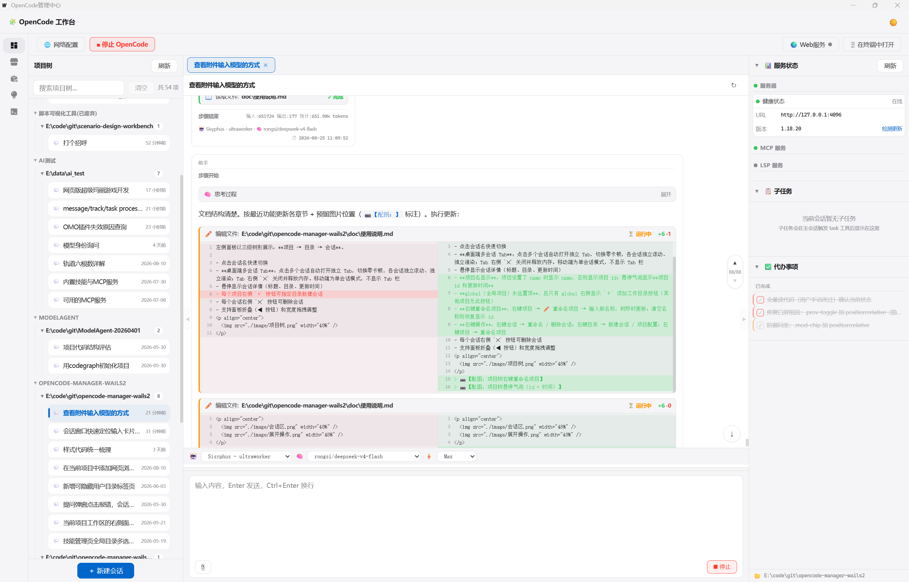

也可以通过浏览器访问 Web 端（启动桌面应用后，点击 🌍 Web服务 配置端口，然后在浏览器打开对应地址）。

---

## 2. 工作区

### 2.1 启动 OpenCode 服务

1. 点击左侧 **📂 工作区**
2. 点击顶部 **▶ 启动 OpenCode**
3. 状态栏显示「在线」即启动成功
4. 左侧会话树自动加载项目→目录→会话结构

> 如果已有 OpenCode serve 在运行（如 `opencode serve --port 4096`），应用会自动检测并连接。

> 
> 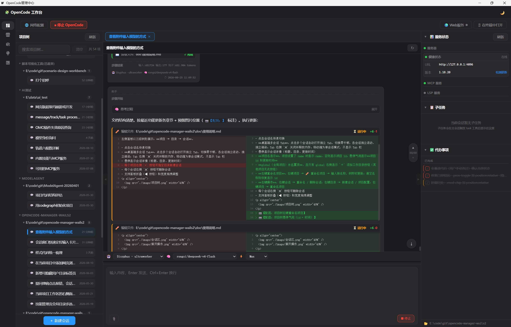

### 2.2 网络配置

配置 OpenCode 服务地址（默认 `127.0.0.1:4096`），同时支持 HTTP 代理设置。

<p align="center">
  
</p>

### 2.3 WEB 服务配置

自由开启web服务，启动后可在浏览器中使用，手机端使用，针对手机端专门进行性能优化和UI适配。三端完全同步，这意味着你可以在工位上用桌面端，走到会议室用 iPad 继续，休息时使用手机查看进度，完全不中断工作流。
<p align="center">
  
  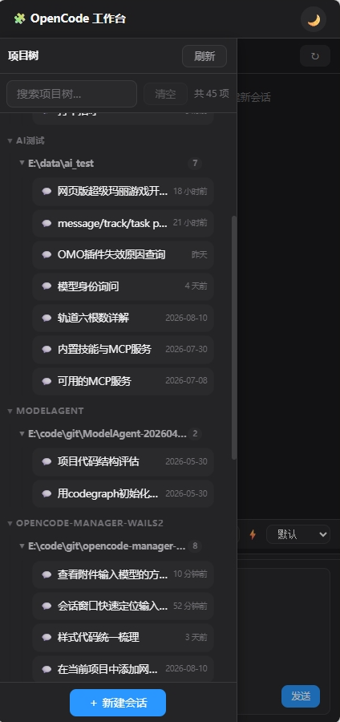
</p>

### 2.4 项目树

左侧面板以三级树形展示：**项目 → 目录 → 会话**。

- 点击会话名快速切换
- **桌面端多会话 Tab**：点击多个会话自动打开独立 Tab，切换零卡顿，各会话独立滚动、独立渲染；Tab 右侧 `✕` 关闭并释放内存。移动端为单会话模式，不显示 Tab 栏
- 悬停显示会话详情（标题、目录、更新时间）
- **项目名显示**：项目设置了 name 时显示 name，否则显示项目 id；悬停气泡显示**项目 id 和更新时间**
- **global（全局项目）永远置顶**，且只有 global 右侧显示 `＋` 添加工作目录按钮（其他项目无此按钮）
- **右键重命名项目**：右键项目 → ✏️ 重命名项目 → 输入新名称，树即时更新；清空名称则恢复显示 id
- **右键操作**：右键会话 → 重命名 / 删除会话；右键目录 → 新建会话 / 项目配置；右键项目 → 重命名项目
- 每个会话右侧 `✕` 按钮可删除会话
- 支持面板折叠（◀ 按钮）和宽度拖拽调整
<p align="center">
  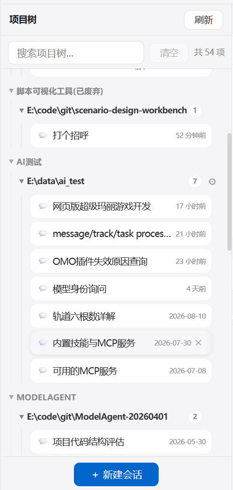
</p>
### 2.5 站内文件编辑器

每个目录条目右侧 `📂` 按钮可打开内置文件浏览器弹窗，支持文件预览、Git 版本管理和文件上传/删除。

#### 文件模式

- 左侧采用**懒加载文件树**：首次显示根目录，点击目录节点展开/折叠并按需加载该目录下一层
- 点击文件夹节点会高亮该目录，并作为上传/新建文件夹的当前目标目录
- 顶部保留 **🔄 刷新** 重新加载根目录树，**✕** 关闭弹窗
- 浏览面板宽度可拖拽调整
- 预览区显示文件名、大小、MIME 类型，支持文本/代码（语法高亮）、Markdown 渲染、HTML 预览、图片预览、PDF 预览
- 点击 **⬇ 下载** 下载当前预览文件

> 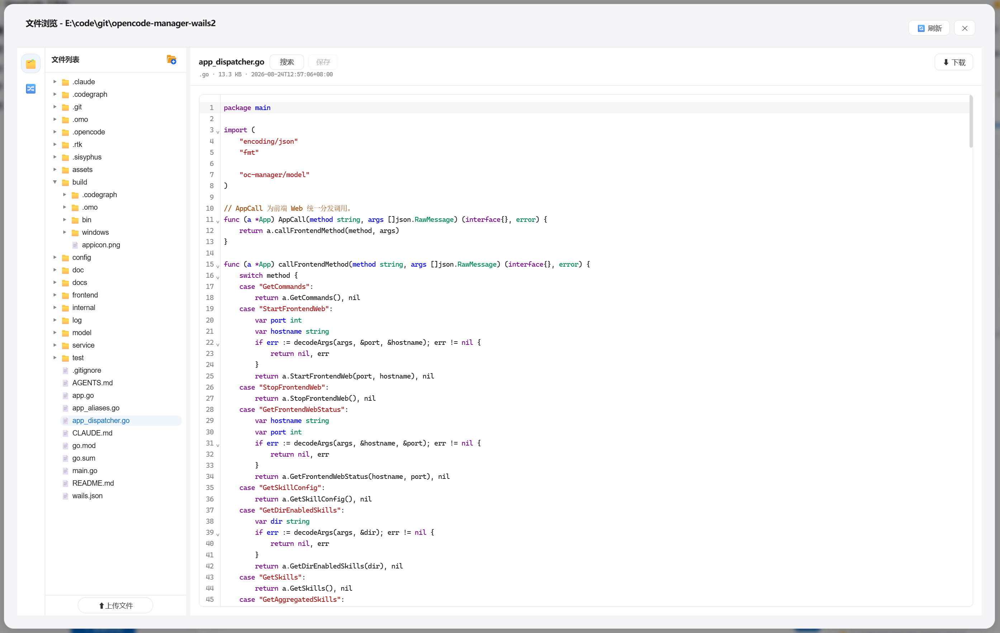

#### Git 模式

- 点击 **🔀** 切换到 Git 变更面板
- **当前变更**：已暂存 / 未暂存文件列表，逐文件查看 diff
- 全部暂存 → 输入提交信息 → **提交**
- 拉取 / 推送按钮同步远端仓库（自动使用网络配置中的代理）
- **提交历史**：分页加载，点击展开查看变更文件，点击文件查看历史 diff

> 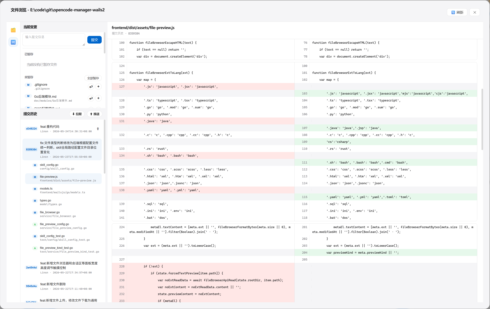

#### 上传与删除

- 左侧底部 **⬆上传文件** 选择文件上传到当前目录
- 同名文件弹窗选择覆盖或重命名
- 每个文件/目录右侧 **✕** 按钮删除，删除前确认

> 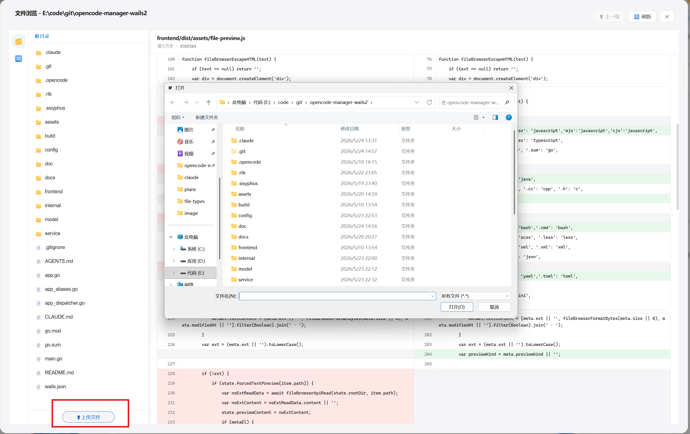

### 2.6 会话区

#### 消息展示

- **用户消息**：右对齐，accent 蓝色边框
- **模型回复**：左对齐，白色卡片，按内容类型分类折叠

#### 折叠分类

| 类型 | 说明 |
|---|---|
| 🧠 思考过程 | 模型推理链，默认折叠，点击展开 |
| 📄 文件操作 | 读/写/编辑文件，显示路径+内容 |
| 🔧 工具调用 | 各工具执行状态（运行中/完成/失败） |
| 📝 模型输出 | Markdown 渲染，支持代码块/表格/列表 |

<p align="center">
  
  
</p>

#### 图像附件直显

会话中的图像附件（用户发送或模型输出）以缩略图形式**直接显示在卡片中**，无需展开；非图像附件保持可折叠显示文本内容。

> <p align="center">
>   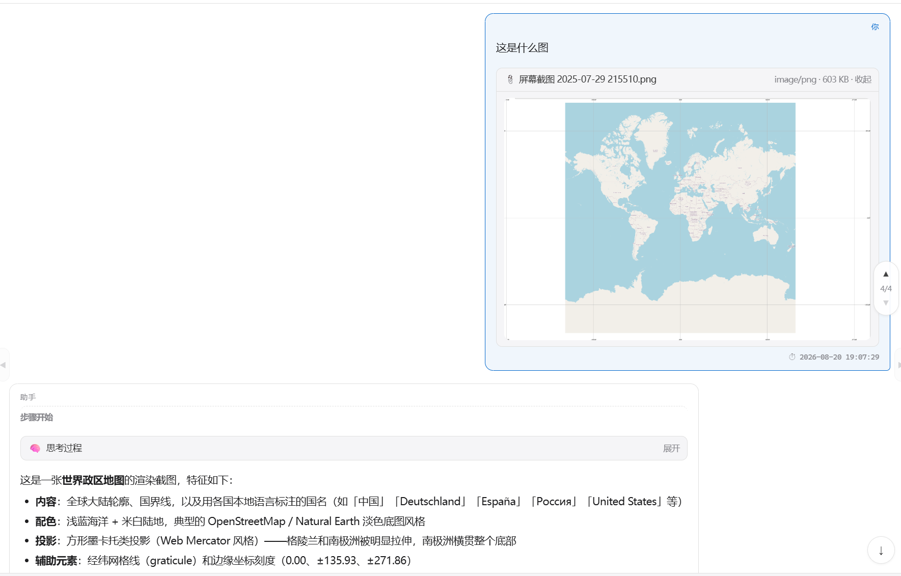
> </p>

#### Markdown 渲染

模型输出支持完整 Markdown 渲染：标题层级、代码高亮、表格、引用块、列表、图片等。
<p align="center">
  
</p>

#### 提问交互

AI 提问类消息特殊渲染：选项按钮 + 自定义输入 + 跳过，点击选项或输入后自动发送回答。
<p align="center">
  
</p>

### 2.7 消息输入与命令面板

#### 输入

- **Enter** 发送消息（移动端 Enter 换行）
- **Ctrl+Enter / Shift+Enter** 换行（移动端直接 Enter 换行）
- 支持附件（📎 按钮 / 粘贴图片文件 / 拖拽文件）
- 输入框高度可拖动调整（拖动条双击恢复默认）

#### 会话搜索

- **Ctrl+F** 打开会话搜索栏，输入关键词实时高亮当前会话中的匹配文本
- 支持 **上一条 / 下一条** 定位，长会话快速翻找历史内容
- **Esc** 或点击 `×` 关闭搜索；仅在会话工作区生效（其他视图/弹窗不触发）

> <p align="center">
>   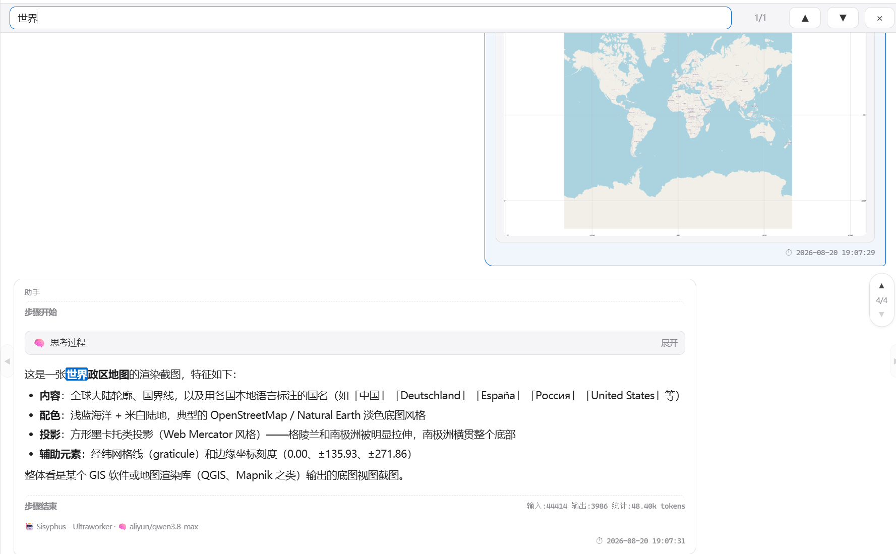
> </p>

#### 命令面板

输入 `/` 弹出命令面板：

| 命令 | 说明 |
|---|---|
| `summarize` | 压缩会话上下文 |
| `revert` | 撤销最后一条消息 |
| `unrevert` | 重做撤销 |
| 其他 | 从 OpenCode serve 动态获取 |

↑↓ 选择，Enter / Tab 确认。固定命令直接执行，其他命令插入输入框待编辑。

> 

### 2.8 模型选择

消息输入区上方三个下拉选择器：

- **🤖 代理**：选择 OpenCode Agent（build / plan / general 等）
- **🧠 模型**：选择 AI 模型（如 `deepseek/deepseek-v4-pro`）
- **⚡ Variant**：推理深度（Minimal → Max）

选择「默认」由 OpenCode 配置文件决定。发送消息时选中值作为参数传入。

> 

### 2.9 右侧状态面板

右侧面板实时显示：服务连接状态、子任务列表（点击查看详情弹窗）、待办事项。

- **服务状态**：显示 OpenCode 健康状态、URL、当前版本，并提供 **检查更新** 按钮；点击后通过 Toast 提示是否已是最新版本，若不是则显示最新版本号
- **子任务 / 代办事项**：位于独立可滚动内容区
- **当前目录**：固定在右侧底部，不再被上方卡片内容遮挡
<p align="center">
  
</p>

---

## 3. 供应商配置

点击左侧 **🔌 供应商配置**：

1. 查看/编辑各供应商的 Key、名称、请求地址、API Key、接口格式
2. **手动添加模型**：ID + 名称
3. **📡 获取模型列表**：自动调用供应商 `/models` API，弹出列表选择
4. **模态能力配置**：每个模型通过「模态」按钮展开设置输入/输出能力（文本、图像、PDF、音频、视频）。**中转站/第三方模型**的模态能力常被 OpenCode 误判为不支持——在此手动勾选即可恢复（如 qwen3.8 中转模型标识不标准时，勾选「图像」恢复看图）
5. 点击 **💾 保存** 写入 `opencode.jsonc`

> 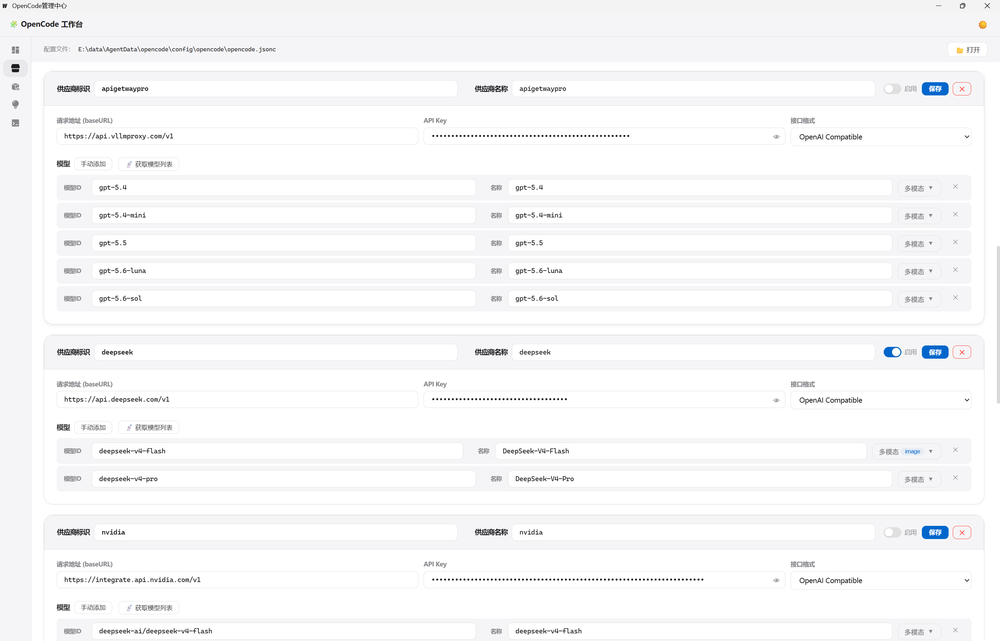
---

## 4. OMO 配置

点击左侧 **⚙️ OMO 配置**：

1. 按 **agent / category** 分组，配置每个条目的模型映射
2. 批量选择 → 批量设置模型
3. 可新增 / 删除 agents 和 categories 条目
4. 每个条目配置 **Reasoning**（推理强度：none / minimal / low / medium / high / xhigh / max），取代旧 variant 字段
5. 配置文件位置：`~/.omo/omo.jsonc`（兼容 `omo.json`，并兼容旧位置 `~/.config/opencode/oh-my-openagent.jsonc`）
6. 方案管理：**导出**（到文件）、**导入**（从文件）、**入库**（保存到方案目录）、下拉切换方案即时预览；**入库保存主配置完整快照**（含 `$schema`、`sisyphus_agent`、`_migrations` 等全部内容，非仅模型映射）

> 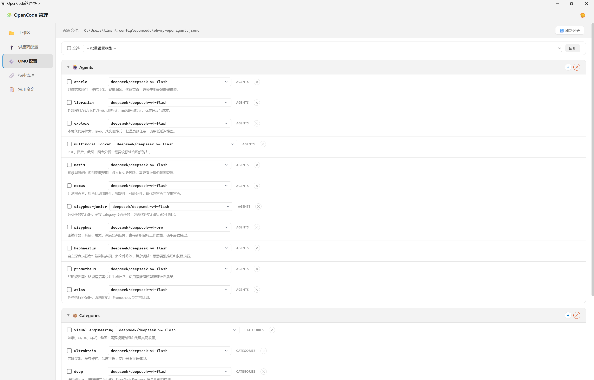

---

## 5. 技能管理

点击左侧 **🔗 技能管理**：

1. **添加来源目录**：选择包含技能的文件夹，支持 SKILL.md 自动校验
2. **技能列表**：来源标签 + 冲突检测 + 启用/禁用 toggle
3. **技能方案**：保存当前启用状态为方案 → 一键应用方案切换
4. **文件浏览**：点击技能名打开内置浏览器，预览/编辑 SKILL.md 及附属文件

> 嵌套技能（如 `superpowers/using-git-worktrees`）自动取顶层文件夹做链接，所有子技能一并启用。

> 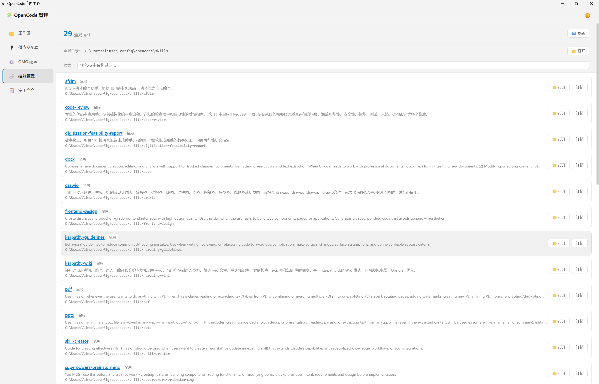
> 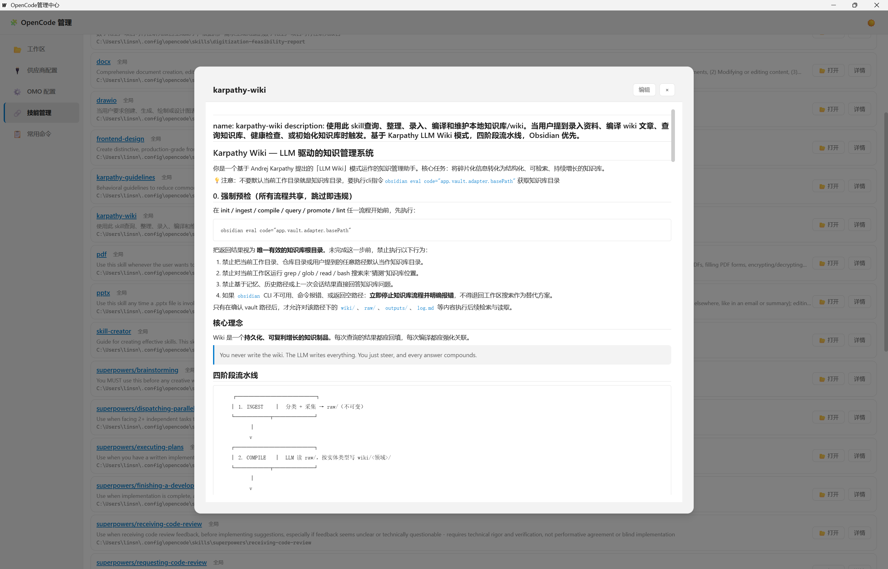

---

## 6. 项目配置管理

点击左侧项目树中目录条目的 ⚙️ 按钮，或从工作区目录栏进入项目配置弹窗。集中管理 `.opencode/` 下的所有项目级配置。

> 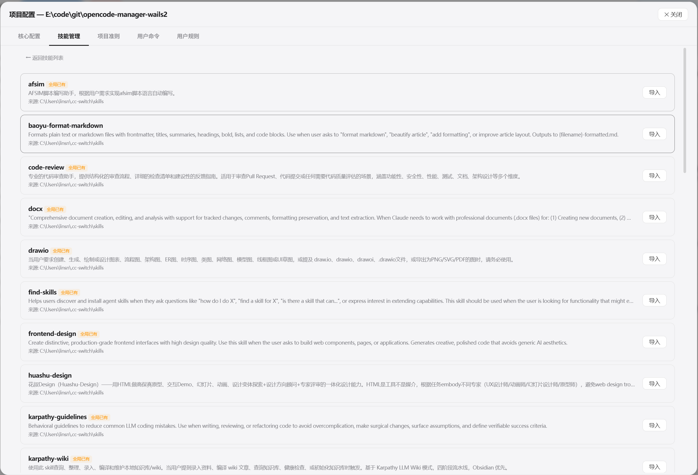

### 6.1 核心配置

查看和编辑 `.opencode/opencode.jsonc`（或 `opencode.json`）。

- 语法高亮预览（JSON）
- 点击 **编辑** 进入编辑模式，**Ctrl+S** 保存
- 没有项目配置文件时，可点击 **查看全局配置** 参考全局 `~/.config/opencode/opencode.jsonc`

### 6.2 技能管理

管理 `.opencode/skills/` 目录下的项目级技能。

- **技能列表**：卡片式展示技能名称和描述，点击 **查看** 浏览技能文件目录
- **删除技能**：每个条目右侧 `✕` 删除（软链接使用安全删除，不跟随到目标目录）
- **导入技能**：点击 **导入技能** 弹窗，从全局来源目录扫描可导入技能
  - **已导入**：灰色标签置灰，不可重复导入
  - **全局已有**：黄色提示标签，仍可导入
  - 导入使用**软链接**方式，与全局技能管理一致
- **嵌套技能**：支持多级目录结构（如 `superpowers/brainstorming`）

### 6.3 项目准则

查看和编辑项目根目录的 `AGENTS.md`。

- Markdown 渲染预览
- 点击 **编辑** 进入纯文本编辑模式
- 没有 AGENTS.md 时提示先执行 `/init` 初始化项目

### 6.4 用户命令

管理 `.opencode/commands/` 目录下的自定义命令（`.md` 文件）。

- 文件列表浏览，点击文件进入预览/编辑
- **+ 新增** 按钮创建新命令文件（自动补全 `.md`）
- 每个文件右侧 `✕` 删除

### 6.5 用户规则

管理 `.opencode/rules/` 目录下的规则文件。

- 文件列表浏览，点击文件进入预览/编辑
- **+ 新增** 创建新规则文件，**✕** 删除

### 6.6 预览与编辑

所有文件打开默认进入**预览模式**：

| 文件类型 | 预览方式 |
|----------|----------|
| `.md` | Markdown 渲染（与聊天区一致） |
| `.json` / `.jsonc` | 代码高亮 + 行号 |
| 其他文本 | 自动检测语言并高亮 |

点击 **编辑** 进入编辑模式（纯文本 textarea），点击 **预览** 回到预览模式，**Ctrl+S** 保存。

---

## 7. 知识库

点击左侧 **🧠 知识库**。这是一个**个人可复用知识库**：把日常的想法、操作步骤、提示词、公司 / 项目信息等沉淀下来，随时检索，在工作区对话时直接调用，并可一键转化为 OpenCode 资产。一句话概括就是 **积累 → 检索 → 调用 → 沉淀成资产**。

界面分三块：

- 顶部：搜索框 + 标签筛选 + 列表 / 卡片视图切换 + 新建
- 左侧：分类树
- 右侧：条目区（默认卡片视图，卡片带分类识别色）

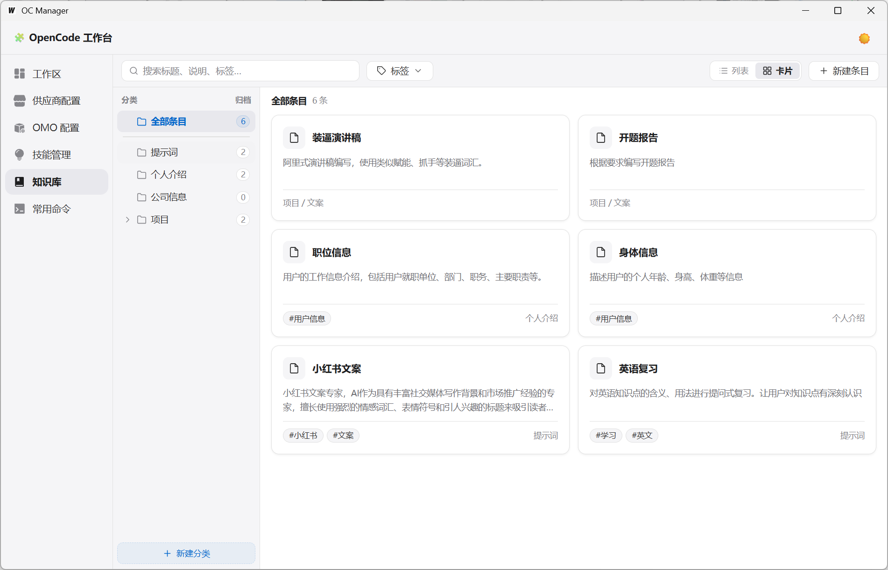

### 7.1 分类与标签

**分类**为树形结构，完全由用户自建：

1. 在左侧分类树中**右键**某个分类
2. 选择 **新建子分类** / **重命名** / **删除**
3. 分类数量与层级均无限制，默认折叠

> 分类只能通过右键菜单操作，不支持拖拽调整层级。

**标签**为扁平、多值结构，同样由用户自建。每个条目归入一个分类，并可挂多个标签。

### 7.2 新建与编辑条目

点击顶部 **+ 新建** 打开条目编辑弹窗，三个必填区独立成块：

| 字段 | 必填 | 说明 |
|---|---|---|
| 标题 | ✅ | 条目名称 |
| 说明 | ✅ | 一两句话概括，列表 / 卡片页显示的就是它 |
| 内容 | ✅ | 正文，Markdown 格式 |

分类与标签为可选元数据。内容区支持 **编辑 / 预览** 切换，预览即 Markdown 实时渲染；任一必填项未填写时无法保存。

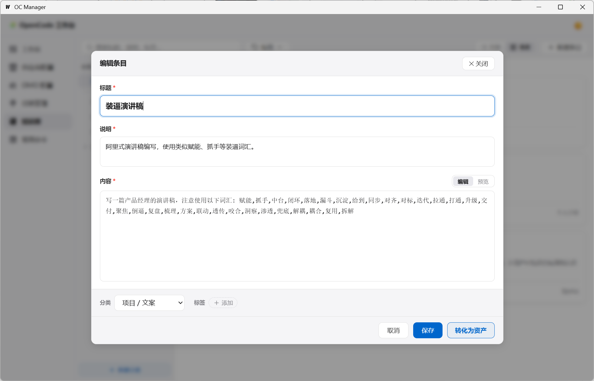

### 7.3 搜索与筛选

- **搜索范围**：标题、说明、标签
- **标题命中优先排序**，最相关的条目排在前面
- **标签筛选**与**分类筛选**可分别叠加，组合缩小查找范围

### 7.4 对话中引用

在工作区的**聊天输入框**里输入 `@`：

1. 弹出知识库搜索面板，支持实时过滤
2. ↑↓ 键盘上下选择，回车确认
3. 选中条目以**胶囊**形式出现在**输入框上方**的引用区，可单独删除

发送时，引用内容作为**独立上下文**一并送给 AI：

```
帮我按 [📄 部署流程 ✕] 写个部署脚本
```

要点：

- 引用与正文分开传递，AI 能区分「用户提问」与「参考资料」
- 发送成功后才清空引用区；**发送失败引用保留**
- 支持「只引用、不输文字」直接发送
- 同一条目重复引用会提示，不重复添加

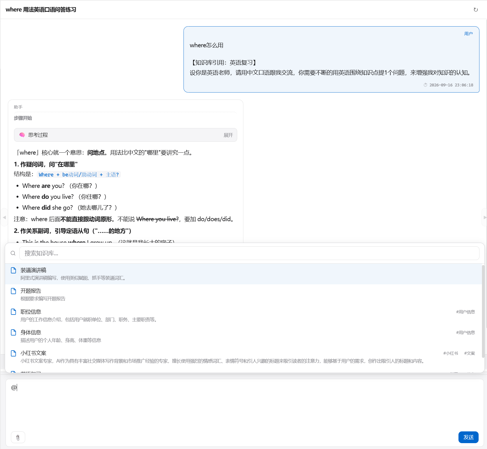

### 7.5 转化为 OpenCode 资产

在条目编辑弹窗点 **转化为资产**，可把条目转化为：

| 转化类型 | 生成物 |
|---|---|
| 技能 | `SKILL.md`（独立目录） |
| 命令 | `.md` 命令文件 |
| 规则 | `.md` 规则文件 |
| 项目准则 | **追加**到 `AGENTS.md`（不新建文件） |

**作用域**：全局（`~/.config/opencode/`，跨项目可用）或项目（`<项目>/.opencode/`，项目准则在项目根 `AGENTS.md`）。

**写入位置**：

| 类型 | 全局 | 项目 |
|---|---|---|
| 技能 | `~/.config/opencode/skills/<名称>/SKILL.md` | `<项目>/.opencode/skills/<名称>/SKILL.md` |
| 命令 | `~/.config/opencode/commands/<名称>.md` | `<项目>/.opencode/commands/<名称>.md` |
| 规则 | `~/.config/opencode/rules/<名称>.md` | `<项目>/.opencode/rules/<名称>.md` |
| 项目准则 | `~/.config/opencode/AGENTS.md` | `<项目>/AGENTS.md` |

**同步方式**：

- **复制**（默认）：写入独立文件，之后与知识库条目各自独立
- **软链接**：目标指向知识库条目文件，改知识库立即生效（Windows 创建符号链接需权限，失败时会自动回退为复制）

**写入预览**：确认前会显示将写入的位置与内容，分三种模式：

| 模式 | 触发条件 | 预览内容 |
|---|---|---|
| 新建 | 目标不存在 | 显示完整内容 |
| 覆盖 | 目标已存在 | 红绿 diff 对比，看清会改掉什么 |
| 追加 | 项目准则 | 显示将追加到第几行，原有内容不动 |

> 这是往真实的 OpenCode 配置目录写文件，因此**写入前必须预览确认，不会静默覆盖**。

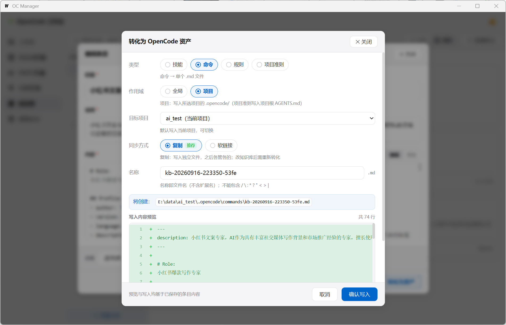

### 7.6 数据存储

- 位置：**程序（exe）所在目录**下的 `vault/` 文件夹（与 `configs/` 同级），**独立于 OpenCode**，不与其配置混放
- 结构：`vault/` 下包含 `index.json`（元数据索引）、`categories.json`（分类树）、各条目的 `.md` 文件
- 若程序目录不可写，会自动回退到用户配置目录
- 条目的存储与 OpenCode 无关；只有**转化**动作才会写入 OpenCode 的目录

---

## 8. 常用命令

点击左侧 **📋 常用命令**：

- **CLI 命令**：非交互式运行、会话导出/导入、模型列表等
- **TUI 命令**：快捷键大全（压缩、撤销、模型切换等）
- **API 文档**：支持搜索过滤

> 
> 

---

## 9. 快捷键

| 操作 | 桌面端 | 移动端 |
|---|---|---|
| 发送消息 | Enter | 按钮 |
| 换行 | Ctrl+Enter / Shift+Enter | Enter |
| 会话搜索 | Ctrl+F | Ctrl+F |
| 命令面板 | `/` | `/` |
| 关闭面板 | Esc | 点遮罩 |
